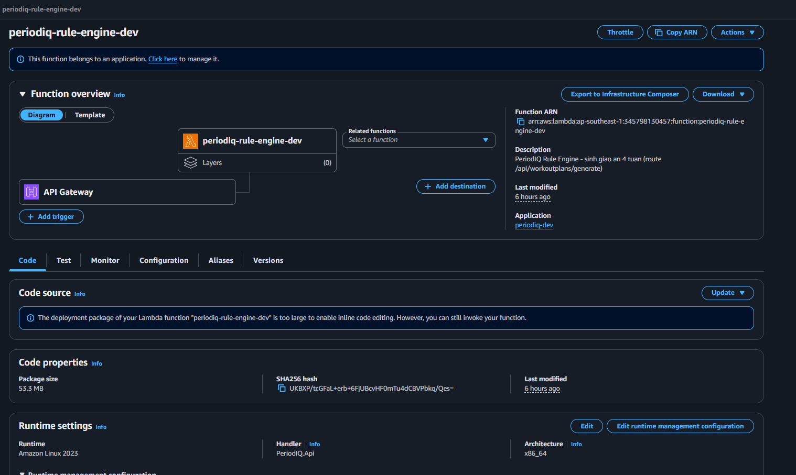
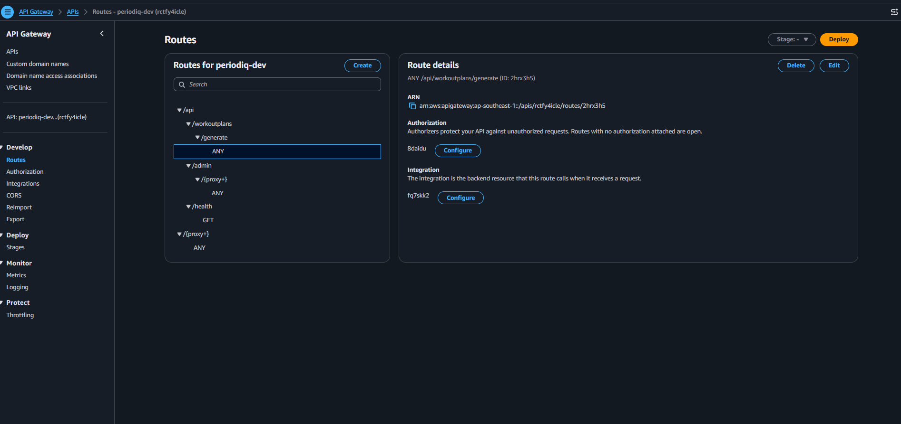
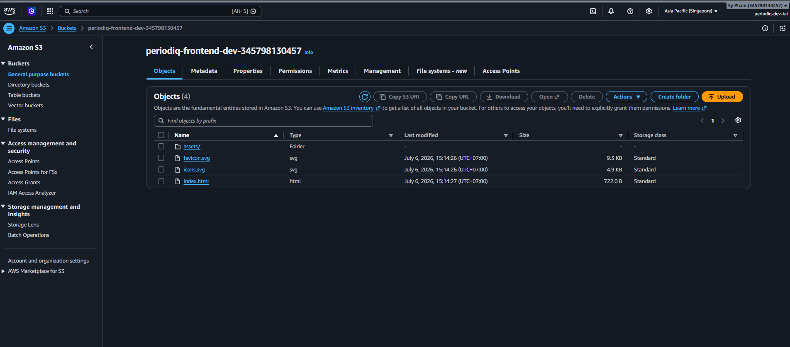
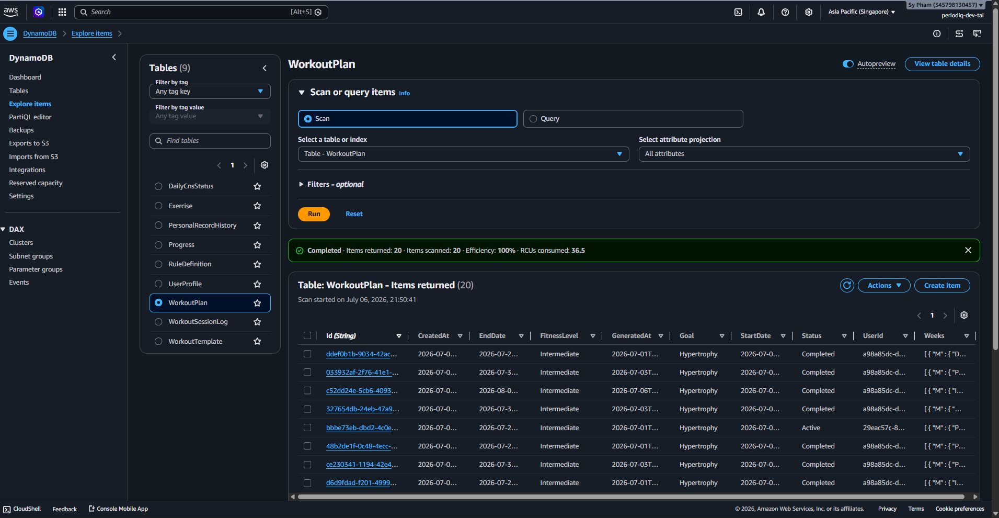
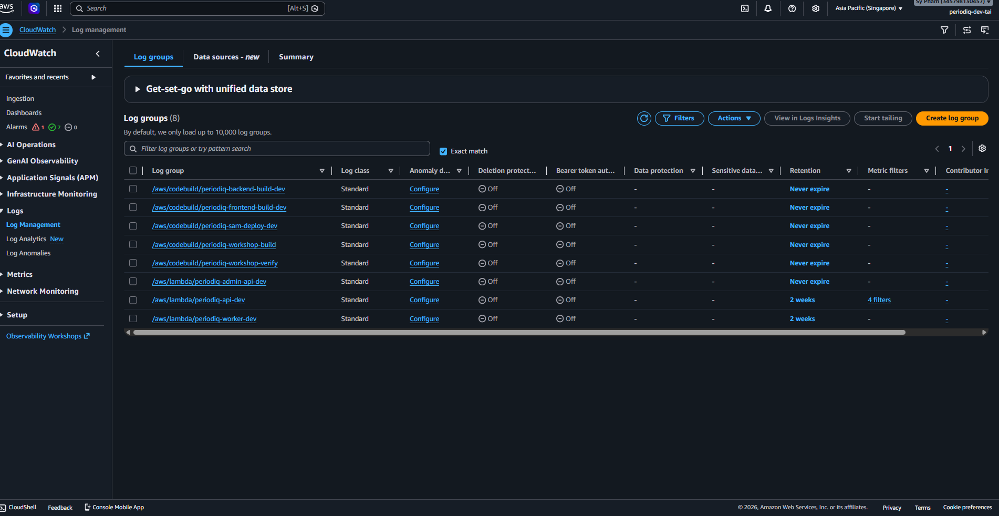
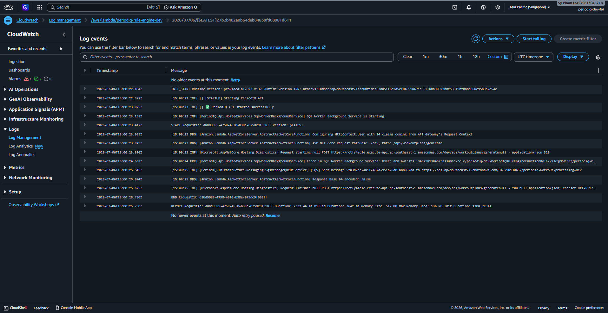

Phần này kiểm tra các dịch vụ AWS được dùng trong luồng sinh giáo án. Mục tiêu là xác nhận request đi từ frontend đến API Gateway, vào Lambda, chạy Rule Engine, lưu kết quả vào DynamoDB và ghi log thực thi lên CloudWatch.

#### Bước 1 - Kiểm tra Lambda Rule Engine

Mở **AWS Console > Lambda > Functions > `periodiq-rule-engine-dev`**.

Kiểm tra các thông tin sau:

- Function name là `periodiq-rule-engine-dev`
- Description có nhắc đến route sinh giáo án `/api/workoutplans/generate`
- API Gateway được gắn làm trigger
- Runtime là Amazon Linux 2023
- Function có thời điểm `Last modified` mới



Lambda này là phần compute phụ trách chạy nhánh backend tạo giáo án. Trong dự án này, Rule Engine áp dụng 3 nhóm luật:

| Nhóm luật | Vai trò |
|---|---|
| **Volume Filter** | Kiểm soát volume tập dựa trên mục tiêu, trình độ và số buổi mỗi tuần |
| **Conflict Resolution** | Giảm tải khi có hạn chế cơ thể hoặc rủi ro stress CNS |
| **Progression Builder** | Xây progression theo tuần và tạo tuần deload |

Cấu trúc 4 tuần mong đợi:

```text
Tuần 1: Xây base volume
Tuần 2: Tăng volume
Tuần 3: Đỉnh intensity
Tuần 4: Deload
```

#### Bước 2 - Kiểm tra route API Gateway

Mở **AWS Console > API Gateway > `periodiq-dev` > Routes**.

Chọn route:

```text
ANY /api/workoutplans/generate
```



Route này là điểm vào API mà frontend gọi khi user bấm **Generate 4-Week Plan**. Request body chứa các thông số tập luyện của user:

```json
{
  "goal": "Hypertrophy",
  "fitnessLevel": "Intermediate",
  "daysPerWeek": 4,
  "startDate": "2026-07-06",
  "mainLifts": {
    "squat": 100,
    "bench": 80,
    "deadlift": 120
  }
}
```

API Gateway chuyển request vào Lambda. Lambda sau đó gọi service layer để sinh và lưu giáo án.

#### Bước 3 - Kiểm tra hosting frontend trên Amazon S3

Mở **AWS Console > S3 > `periodiq-frontend-dev-345798130457` > Objects**.

Kiểm tra các file build React + Vite đã tồn tại:

- `index.html`
- `assets/`
- `favicon.svg`
- `icons.svg`



S3 lưu các file tĩnh của frontend. Trang Workout Plan nằm trong SPA này và gọi backend API thông qua API base URL đã cấu hình.

#### Bước 4 - Kiểm tra giáo án được lưu trong DynamoDB

Mở **AWS Console > DynamoDB > Explore items > `WorkoutPlan`**.

Chạy scan và kiểm tra các giáo án đã được tạo.



Các trường quan trọng cần kiểm tra:

| Trường | Ý nghĩa |
|---|---|
| `Id` | ID duy nhất của giáo án |
| `UserId` | User tạo giáo án |
| `Goal` | Mục tiêu tập như Hypertrophy hoặc Endurance |
| `FitnessLevel` | Beginner, Intermediate hoặc Advanced |
| `StartDate` / `EndDate` | Khoảng thời gian 4 tuần |
| `Status` | Trạng thái giáo án |
| `Weeks` | Cấu trúc tuần được Rule Engine sinh ra |

Trường `Weeks` là output chính của chức năng tôi phụ trách. Nó chứa cấu trúc tuần, ngày và bài tập trả về cho frontend.

#### Bước 5 - Kiểm tra CloudWatch log groups

Mở **AWS Console > CloudWatch > Logs > Log groups**.

Kiểm tra các log group của Lambda backend.



Với phần của tôi, các log group quan trọng là:

```text
/aws/lambda/periodiq-api-dev
/aws/lambda/periodiq-rule-engine-dev
```

Các log group này dùng để debug request API, quá trình chạy Lambda và lỗi khi sinh giáo án.

#### Bước 6 - Kiểm tra log Rule Engine khi sinh giáo án

Mở log stream mới nhất trong:

```text
/aws/lambda/periodiq-rule-engine-dev
```

Tạo giáo án từ frontend, sau đó kiểm tra log stream có:

- `POST /api/workoutplans/generate`
- HTTP status `200`
- Lambda `START`, `END`, `REPORT`
- Message SQS sau khi sinh giáo án



Điều này chứng minh endpoint sinh giáo án đã chạy thật trên AWS, trả kết quả thành công và tiếp tục luồng bất đồng bộ bằng cách gửi message sang SQS.

#### Kết quả

Đến bước này, phần AWS trong vai trò của tôi đã được xác minh:

```text
Frontend trên S3
  -> API Gateway route /api/workoutplans/generate
  -> Lambda Rule Engine
  -> DynamoDB WorkoutPlan item
  -> CloudWatch execution log
```

Không cleanup tài nguyên vì đây là tài nguyên dùng chung của nhóm PeriodIQ và cần giữ lại cho demo cuối.
