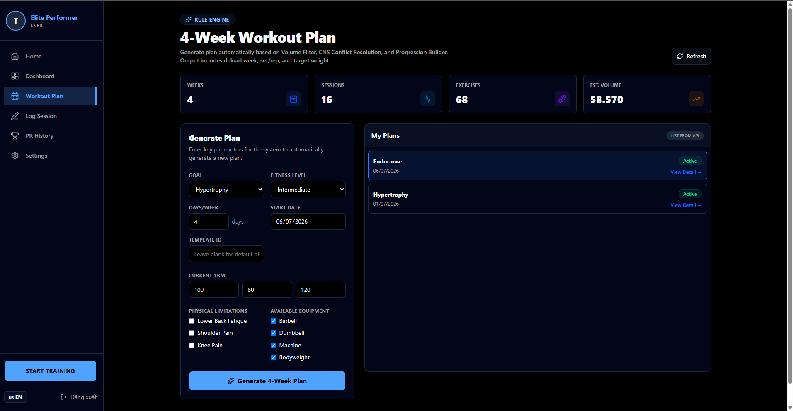
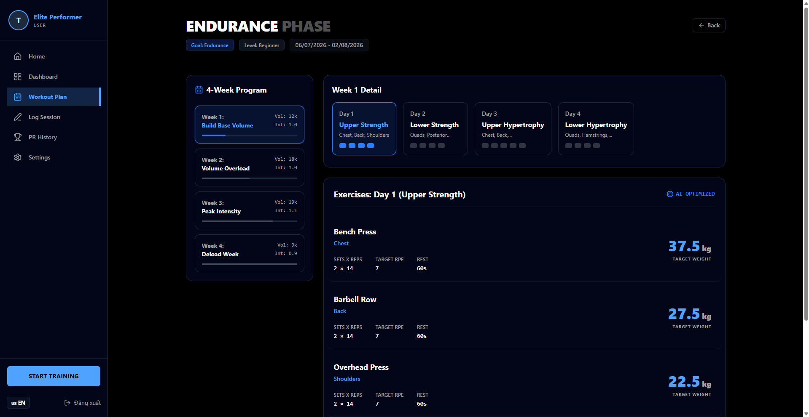

Phần này kiểm tra chức năng sản phẩm dành cho user: tạo và xem giáo án 4 tuần từ frontend PeriodIQ.

#### Bước 1 - Mở trang Workout Plan

Đăng nhập PeriodIQ và mở **Workout Plan** ở sidebar.

Trang này gồm:

- Thống kê tổng quan của giáo án
- Form tạo giáo án mới
- Danh sách giáo án hiện có lấy từ API
- Nút xem chi tiết từng giáo án



Form thu thập các thông tin tối thiểu để Rule Engine sinh giáo án:

| Input | Mục đích |
|---|---|
| `Goal` | Chọn mục tiêu tập luyện |
| `Fitness Level` | Điều chỉnh volume và intensity |
| `Days/Week` | Xác định số buổi tập mỗi tuần |
| `Start Date` | Xác định khoảng thời gian 4 tuần |
| `Current 1RM` | Tính mức tạ mục tiêu |
| `Physical Limitations` | Giúp luật conflict giảm rủi ro |
| `Available Equipment` | Lọc bài tập theo thiết bị |

#### Bước 2 - Tạo giáo án 4 tuần

Nhập dữ liệu vào form và bấm:

```text
Generate 4-Week Plan
```

Frontend gửi request đến:

```text
POST /api/workoutplans/generate
```

Sau khi API trả về thành công, giáo án mới xuất hiện trong phần **My Plans**.

#### Bước 3 - Mở chi tiết giáo án vừa tạo

Bấm **View Detail** trên giáo án vừa tạo.



Trang chi tiết hiển thị output cuối cùng của Rule Engine:

- Chương trình 4 tuần
- Progression theo từng tuần
- Split theo từng ngày
- Danh sách bài tập
- Set và rep
- Target RPE
- Thời gian nghỉ
- Mức tạ mục tiêu tính theo kg

#### Bước 4 - Kiểm tra kết quả periodization

Giáo án được sinh theo cấu trúc periodization mong đợi:

| Tuần | Hành vi mong đợi |
|---|---|
| Tuần 1 | Xây base volume |
| Tuần 2 | Tăng volume |
| Tuần 3 | Đẩy intensity lên cao |
| Tuần 4 | Giảm tải để deload |

Trong ảnh sản phẩm, tuần 4 được đánh dấu là **Deload Week**, chứng minh luật phục hồi đã được áp dụng thay vì tăng tải liên tục.

#### Bước 5 - Kiểm tra tính toán mức tạ mục tiêu

Mỗi bài tập hiển thị mức tạ mục tiêu. Ví dụ:

```text
Bench Press: 37.5 kg
Barbell Row: 27.5 kg
Overhead Press: 22.5 kg
```

Các con số này được sinh từ input của user và intensity của giáo án. Nhờ vậy user không cần tự đoán mức tạ làm việc.

#### Bước 6 - Xác nhận kết quả cho user

Sau luồng này, user có thể:

- Tạo giáo án 4 tuần mới
- Xem giáo án đã lưu từ API
- Mở chi tiết giáo án
- Theo dõi từng ngày tập
- Nhìn rõ logic deload và progression

Điều này hoàn thành phần sản phẩm trong vai trò của tôi: Rule Engine không chỉ là logic backend mà đã trở thành chức năng hoạt động được trên giao diện.
